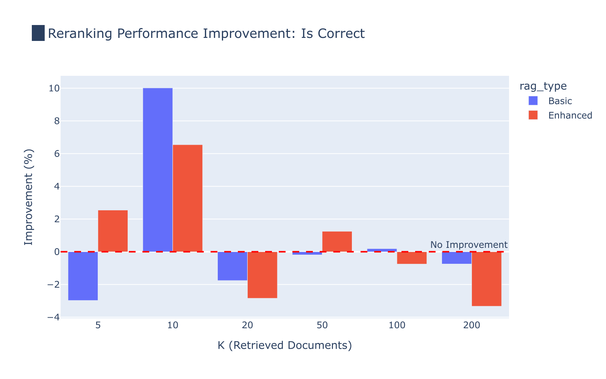
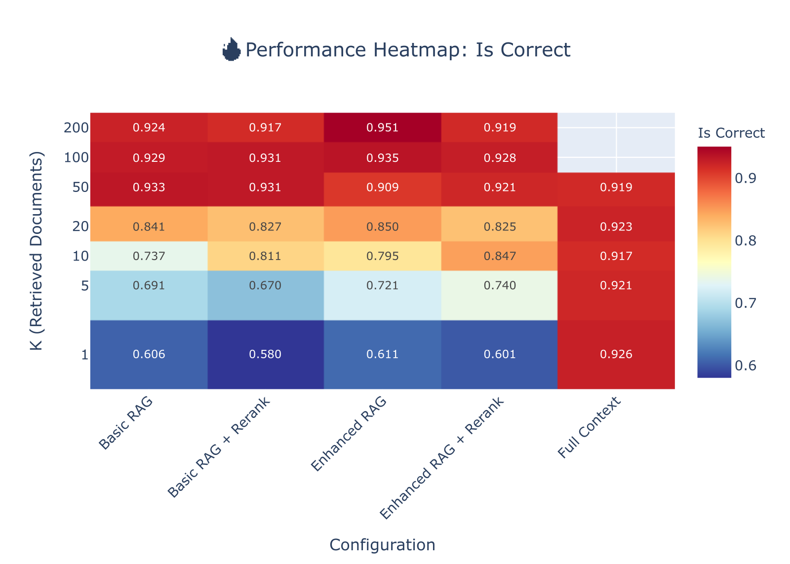
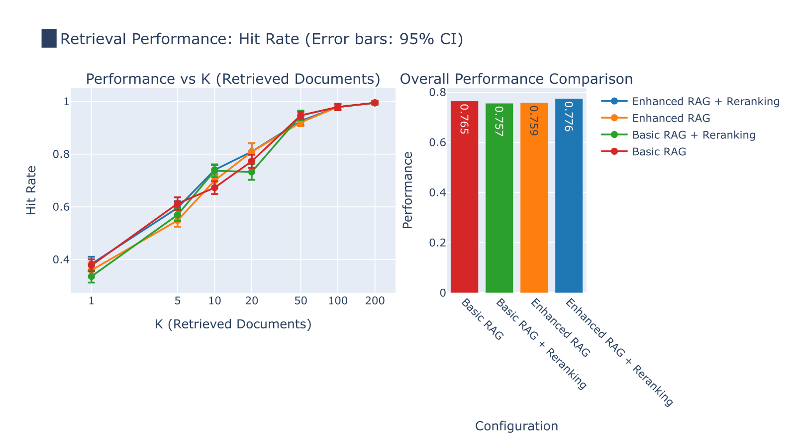
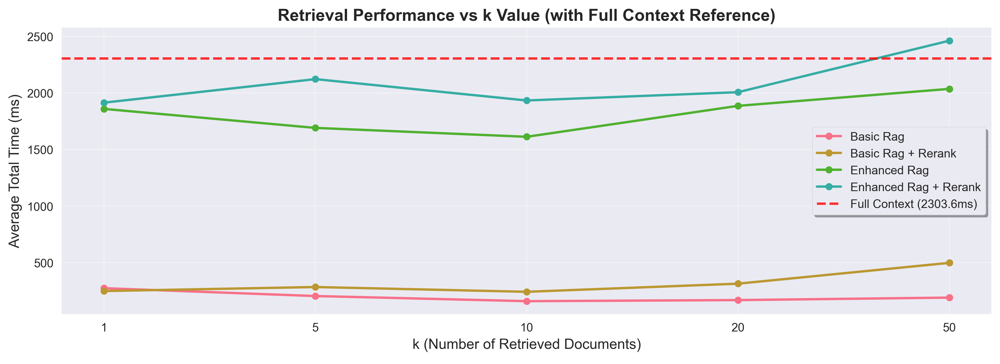
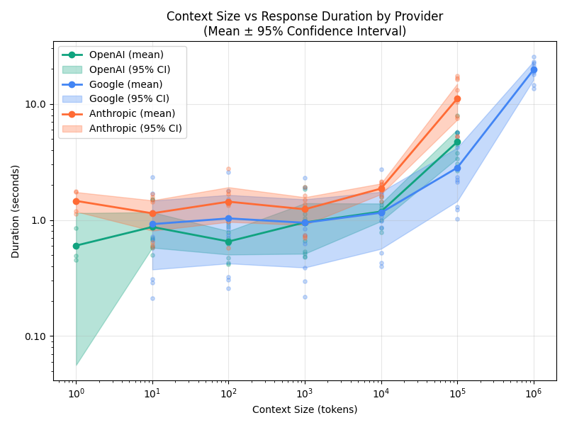

Six months of RAG optimization. Query rewriting, reranking, hybrid search — the full playbook got us from 60% to 70% on ESG metrics.

Then someone asked: what if we just put the whole document in the context window?

85%.

That question turned into a research project, a PyData Amsterdam 2025 talk, and now a write-up. A few things I didn't expect going in:

▶ For single documents in our tests, context-only matched tuned RAG. Simpler pipeline, same answers. If your domain fits in <100k tokens, retrieval infrastructure often isn't earning its keep.

▶ The 100k token quality cliff is real. Past it, performance degrades sharply with distractors and dissimilar phrasing (per @Chroma's excellent Context Rot research, which this post builds on).

▶ Positional reranking — the "reorder the top-k to dodge lost-in-the-middle" job — didn't improve correctness at k=50 in our setup. Shuffling chunks sometimes even helped. Modern LLMs look more position-robust than Liu et al.'s 2023 work implied.

▶ You probably need more chunks than you think. k=50 beat k=5 and k=10 within a single document — retrieving ~27% of it. At corpus scale this almost certainly inverts.

▶ Latency scales better than quadratic, but still hurts. From 100k to 1M tokens, expect 4–10x slower responses.

Closing thought: a lot of the RAG playbook was written for mid-2023 models. Some of its defaults (low k, mandatory reranking, chunking-first) haven't aged as well as we assumed.

Full post, plots, and a long limitations section in the first comment ↓

If you run a reranker in production — is it actually moving your answer quality, or just your retrieval metrics? Genuinely curious.

#RAG #LLM #GenAI #AIEngineering #LongContext

---

**First comment (paste separately after posting):**

Full write-up: https://blog.baukebrenninkmeijer.nl/blog/2025-07-15-long-context-vs-rag/

Code + experiment data: https://github.com/Baukebrenninkmeijer/pydata-2025-context-is-king

---

**Posting checklist:**
- [ ] Attach one chart as image (see options below — PNGs already in `astro/public/posts/long-context-vs-rag/`)
- [ ] Verify @Chroma tag resolves to their company page before posting
- [ ] Paste first comment within ~30 seconds of publishing (LinkedIn weights early-comment engagement)

---

**Image options (ranked, pick one):**

1. *Strongest match for the post's most contrarian claim.* Shows answer correctness is flat with vs. without reranking despite retrieval metrics improving. Pairs directly with the reranker question in the hook.

   

2. Same message as #1, higher information density. Reranking and no-reranking rows are visually indistinguishable across every k. Better for a reader who'll zoom in; worse for a thumbnail-glance scroller.

   

3. Supports the "you need more chunks than you think" bullet. Monotonic climb from k=1 to k=50 is easy to read in 2 seconds.

   

4. Supports "simpler pipeline, same answers" — shows full-context latency is comparable to RAG under ~30k tokens. Already PNG, no conversion needed.

   

5. Supports the 4–10x latency bullet. Good if you want to lean into the "latency still hurts" caveat rather than the RAG-vs-context headline.

   

**My pick:** #1 if you want engagement bait (contradicts conventional wisdom, invites disagreement). #4 if you want broader reach (speed is a universally legible axis).
