:::{.callout-note}
This research was conducted in August 2025. Model capabilities and pricing move fast -- some numbers (latencies, throughput, accuracy cliffs) may no longer reflect the current generation of models.
:::

Six months of RAG optimization. Query rewriting got us from 60% to 65%, reranking to 68%, hybrid search to 70% accuracy extracting ESG metrics from annual reports (measured on a manually labeled evaluation set). Each trick bought us two or three points. Then someone asked: *what if we just put the whole document in the context window?*

We got 85%.

That question kicked off a research project that became a [PyData 2025 talk](https://pydata.org/amsterdam2025/) in September. Writing it up took a while -- after a talk you sometimes just want to move on from the topic for a bit. But the results keep coming up in conversations, so here's the write-up: when long context windows beat RAG, where they fall apart, and what you should actually do about it.

:::{.callout-tip}
## TL;DR
- **Single document under ~30k tokens?** Skip RAG in our tests -- context-only matched tuned RAG and was simpler.
- **The 100k token quality cliff is real** -- performance degrades sharply with distractors and dissimilar phrasing (per [Chroma's research](https://www.trychroma.com/research/context-rot)).
- **Position-based reranking didn't improve correctness at k=50** -- modern LLMs look more position-robust than [lost-in-the-middle](https://arxiv.org/abs/2307.03172) research implied. Rerankers still have a job at low k and as filters; the historical "reorder the top-k to dodge lost-in-the-middle" job looks weaker.
- **Use way more chunks than you think** -- within a single document, k=50 outperformed k=5 or k=10 significantly. At corpus scale this almost certainly inverts.
:::

## The problem that started it all

At a bank, we needed to extract emissions data from annual reports for ESG analysis. Traditional RAG kept failing:

- Chunking destroyed cross-references between sections
- There was no standard ESG jargon across companies
- No good ground truth dataset existed for evaluation

Meanwhile, context windows were growing rapidly. In just two years, we went from 4k to over 1M tokens. An ABN AMRO annual report is around 500k tokens: it *fits*.

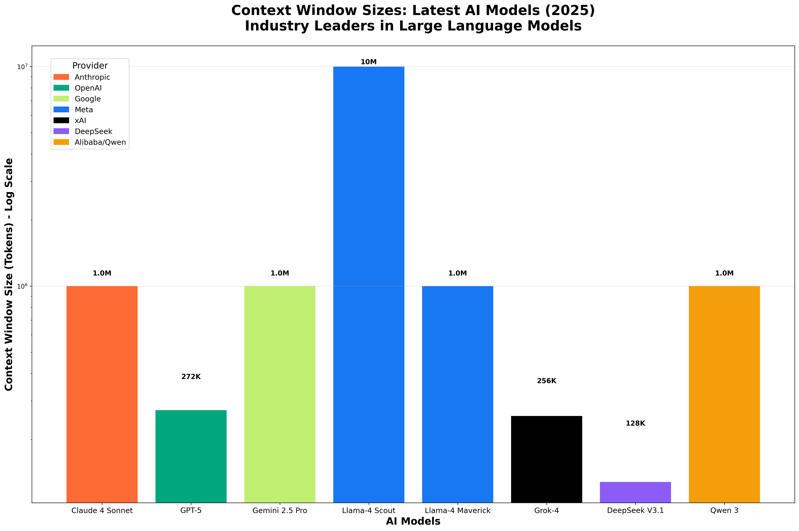{#fig-context-windows}

That growth isn't monotonic, though. Gemini's 2M window was quietly cut back to 1M. Llama-4 Scout advertises 10M tokens but Meta's own API only serves 128k and third parties cap it at 1M. Claude Sonnet 4's 1M window isn't yet in general availability. The headline numbers are real, but availability lags the announcement.

The Lord of the Rings trilogy? That fits too. But as we'll see, fitting in the context window and actually *understanding* all of it are very different things.

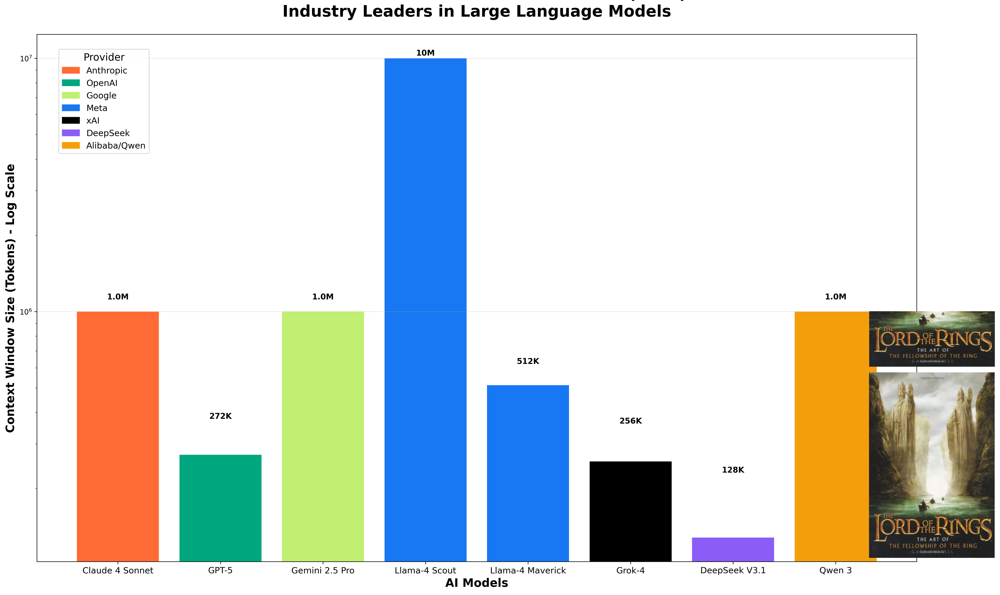{#fig-context-lotr}

So the natural question became: **can we skip RAG entirely and just put the whole document in the context window?**

## The research questions

This research, building on Chroma's [Context Rot](https://www.trychroma.com/research/context-rot) study, set out to answer four questions:

1. **How fast are LLMs** at processing large context windows?
2. **When can we skip RAG entirely?**
3. **Where's the performance cliff** as context grows?
4. **Does position-based reranking** still earn its complexity for modern LLMs?

## Speed: how fast are LLMs with large context?

The common assumption is that attention scales quadratically with context length. Luckily, modern implementations do much better than that.

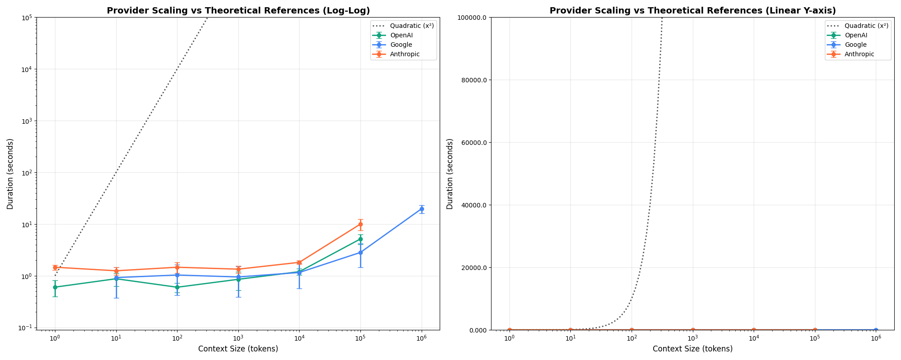{#fig-scaling}

:::{.callout-note}
## Speed benchmark setup
Six models tested via the [orq.ai](https://orq.ai) proxy: `gpt-5-mini`, `gpt-4.1-nano`, `gemini-2.5-flash`, `gemini-2.0-flash-lite-001`, `claude-sonnet-4-20250514`, `claude-3-haiku-20240307`. Context sizes: exact powers of 10 (10, 100, 1k, 10k, 100k, 1M tokens), 3 iterations per point (108 API calls total). Prompts asked for a 1-2 sentence summary with `max_tokens=50, temperature=0`. Haystacks were built from Paul Graham essays + ArXiv papers, shuffled at the sentence level, and trimmed character-by-character against the `gpt-4o` tokenizer to hit the target length exactly. Caveat: the short output means these numbers are dominated by prefill, not generation -- streaming UX will look different.
:::

### Latency starts climbing after 10k tokens

Across providers, there's a clear inflection point around 10k tokens where latency starts increasing meaningfully. This is the *speed* threshold -- distinct from the *quality* cliff at 100k tokens we'll see later.

{#fig-duration}

From 100k to 1M tokens, latency increases between **4x and 10x**. At 100k tokens you're looking at roughly 5 seconds; at 1M, that's 20+ seconds.

### Time-to-first-token tells a similar story

If you're streaming responses, TTFT is what your user actually feels. It tracks total duration closely -- prefill dominates.

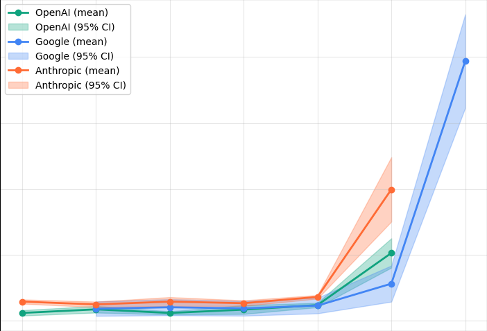{#fig-ttft}

Fitting exponential curves to the per-provider data makes the scaling behavior easier to compare directly:

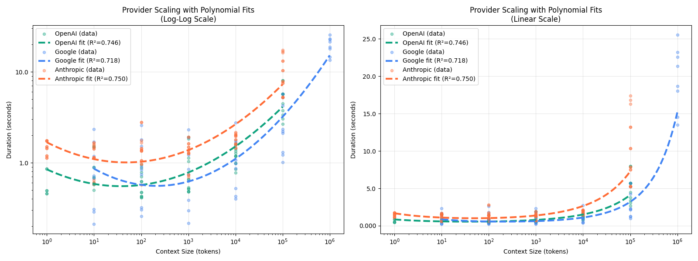{#fig-expfit}

### Token throughput flattens out

While latency increases, token throughput (tokens per second) holds relatively steady rather than collapsing. This suggests the latency increase is roughly proportional to context size, not quadratic.

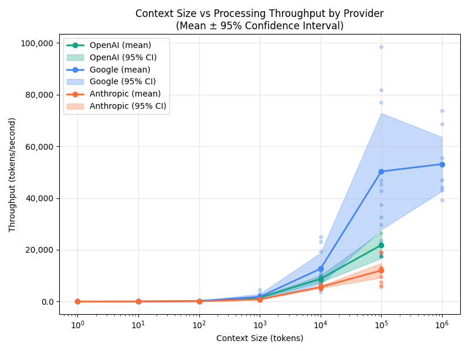{#fig-throughput}

### Google's three-tier speed system

Google deserves special mention here. Their model lineup -- Gemini Flash Lite, Flash, and Pro -- creates a well-differentiated tiered system where lighter models are genuinely faster and all reliably scale to 1M tokens.

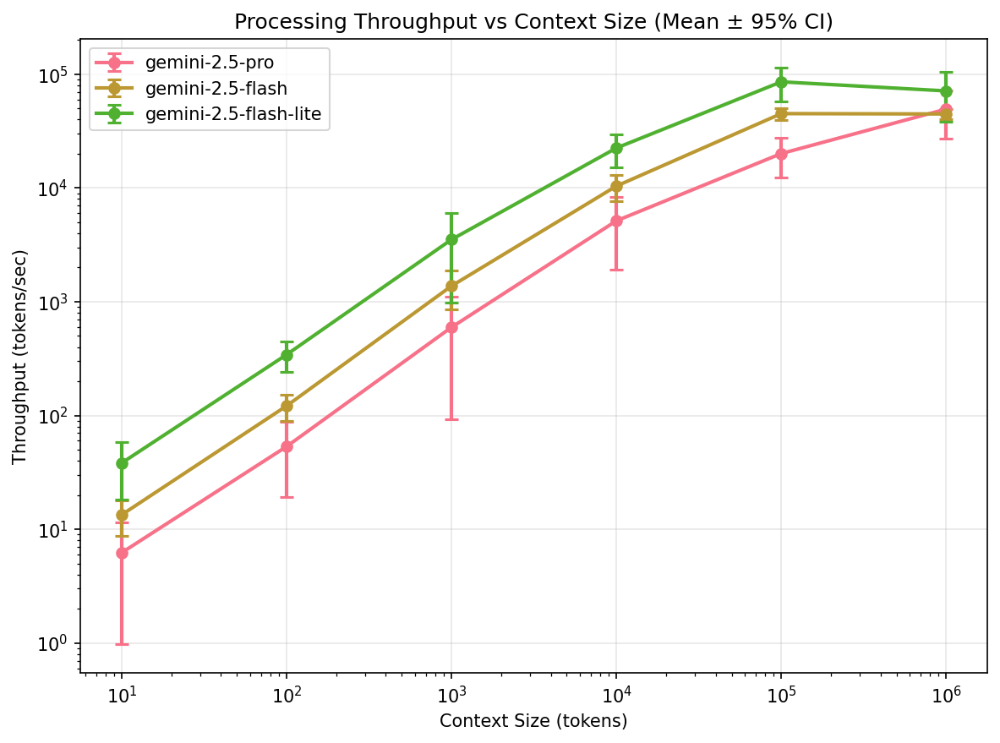{#fig-gemini}

GPT and Claude don't show this same clean tiering -- their models cluster closer together in speed, with less predictable differentiation across context sizes.

### Speed takeaways

- **Scaling beyond 100k tokens is costly** -- expect 4-10x latency increase
- **Gemini is often the fastest** for large context workloads
- **It's better than quadratic**, but still significant

## Quality: how well do context windows actually work?

:::{.callout-note}
## This section summarizes Chroma's work
The quality findings below come from Chroma's excellent [Context Rot](https://www.trychroma.com/research/context-rot) study, not my own experiments. I include them because they're the foundation the rest of the post builds on. If you already know this work, [skip ahead to the reranking experiments](#reranking-does-it-still-fight-lost-in-the-middle).
:::

Needle-in-a-Haystack (NIAH) benchmarks look great on paper. You insert a fact into a long document, ask about it, and models nail it. But how well do they work for *non-trivial* tasks?

### Experiment 1: What happens when the needle doesn't look like the question?

Standard NIAH benchmarks typically have high cosine similarity between the question and the inserted answer. Real-world scenarios often don't. You might ask about "carbon emissions targets" and the answer is buried in a paragraph about "Scope 3 downstream value chain assessments."

The Chroma team split needles into two groups based on embedding similarity:

- **Similar** to the query (easy mode)
- **Dissimilar** to the query (real-world mode)

.](img/needle_haystack_similarity_chroma.png){#fig-similarity}

**Key finding**: Dissimilar question-answer pairs are challenging for all models, especially after 100k tokens. Smaller models degrade faster.

### Experiment 2: The distractor problem

In real documents, there's rarely just one relevant-looking passage. Consider a coding agent with 10 different versions of your updated function in the context window. Or an annual report where multiple sections discuss similar metrics in different contexts.

#### Context rot in the wild

If you've used Claude Code, Cursor, or any agentic coding tool on a long session, you've already seen this failure mode. The agent creates a `v2` of a function, then a `v3`, then patches the original, then forgets which version is canonical. It writes a checkpoint file, then starts over from scratch the next turn. It does an incomplete grep, decides nothing exists, and reimplements what it missed. These aren't bugs in the tool -- they're what happens when eight competing versions of "the right answer" sit in the same context window and the model picks whichever one is most salient right now. Which is exactly the distractor problem, just at production scale.

The Chroma team tested this with explicit distractors: passages similar to the answer but containing different (wrong) information.

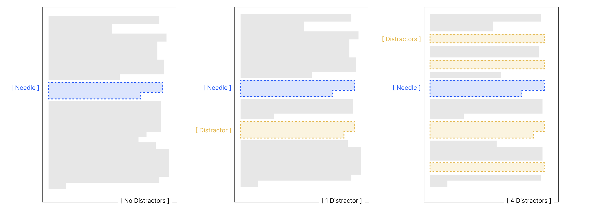{#fig-distractor-viz}

> **Question**: What colour was the duck I had as a child?
>
> **Needle**: The duck I had when I was 10 was orange.
>
> **Distractors**:
>
> - *My brother's duck was blue*
> - *The duck I had as an adult was purple*
> - *The childhood pig was pink*

.](img/distractor_performance_high_performance_chroma.png){#fig-distractors}

The results are unambiguous: more distractors mean worse performance across all models. Smaller models degrade fastest, and even a single distractor reduces performance relative to the baseline.

#### Failure modes differ by model family

Model families fail in different ways. Claude hallucinates the least, but this comes with a trade-off.

.](img/niah_failure_modes_chroma.png){#fig-failure-modes}

### Experiment 3: Long conversational QA

For a more realistic test, the Chroma team used the LongMemEval dataset: 306 chat-based questions averaging ~113k tokens of context, compared against focused prompts with only ~300 tokens of relevant context. Questions span several types -- single-session preference, temporal reasoning, knowledge update, multi-session, and more -- which matters because full-context performance isn't uniform across them.

.](img/longmemeval_question_types_chroma.png){#fig-lme-types}

**Claude** refuses to answer when in doubt. Is this good or bad? It reduces hallucination but also reduces recall.

.](img/chroma_claude_results_longmemeval.png){#fig-claude-longmem}

**GPT** sits in the middle -- less cautious than Claude, less capable than Gemini with reasoning.

.](img/chroma_gpt_results_longmemeval.png){#fig-gpt-longmem}

**Gemini** performed the best overall, especially when using reasoning capabilities.

.](img/chroma_gemini_results_longmemeval.png){#fig-gemini-longmem}

### Quality takeaways

- Long context Q&A is **very much unsolved** -- even at "only" 113k tokens
- **Reasoning helps a lot** (models with chain-of-thought do better)
- **Hallucination prevention can backfire** (Claude's caution hurts recall)
- The **100k token threshold** is where things start going wrong

## Reranking: does it still fight lost-in-the-middle?

Reranking has had two historical jobs in RAG pipelines. One is improving retrieval recall at low k -- pulling the right chunk into a short window. The other is *positional*: given you're stuffing k=50 chunks into the context, put the best ones first (or last) so attention doesn't strand them in the middle. This second job was the main motivation in the influential [Lost in the Middle](https://arxiv.org/abs/2307.03172) paper (Liu et al. 2023), which showed U-shaped attention on mid-2023 models.

We tested the *positional* job: does ordering the retrieved chunks still matter once they're in context? The answer seems to be "much less than it used to." Before the experimental details, here's what's actually in scope:

| Reranker's job | What it does | Tested here? | Current verdict |
|---|---|---|---|
| **Positional ordering** | Put best chunks first/last so attention doesn't strand them (lost-in-the-middle) | Yes -- k=1 to 50 in a ~20k-token window | No measurable lift on correctness; shuffling sometimes helps |
| **Recall at low k** | Pull the gold chunk into a short window when base retrieval misses it | Partially -- tested with a legacy `ms-marco-MiniLM-L-6-v2` cross-encoder only | Open -- modern commercial and open-source rerankers not evaluated |
| **Confidence-based filtering** | Drop low-score chunks to trim context | No | Not evaluated |

The claim this post makes is narrow: **positional reranking in a mid-sized context window doesn't move correctness**. "Reranking is useless everywhere" is a stronger claim the data doesn't support.

### Experiment setup

We ran a full experiment:

- **RAG types**: Basic RAG and Enhanced RAG (LLM query rewriting + dual retrieval + Reciprocal Rank Fusion)
- **Reranking**: With and without, using `cross-encoder/ms-marco-MiniLM-L-6-v2`
- **Baseline**: Full context window (no retrieval)
- **Answer model**: GPT-4.1-mini (temp=0, `max_tokens=500`), prompt: *"Answer the question based on the retrieved context."*
- **Embeddings**: `text-embedding-3-small`
- **Chunking**: 500 tokens with 50-token overlap
- **200 questions** grouped into context-size bins: 0–25k, 25–75k, 75–150k tokens
- **1 to 50 chunks** retrieved per query
- **3 runs each**, `~35,000 total datapoints`

Ground truth came from the LongMemEval "focused" gold spans: for each question, we scored every chunk in ChromaDB (~50k chunks) against the gold span using **Jaccard similarity (≥0.65 threshold), ROUGE-L, and token containment**. Three correlated surface-overlap metrics is more defensible than cosine-only, but it's still lexical -- paraphrased gold chunks can slip through. Noted in the limitations.

{#fig-eval-flow}

#### How we scored correctness

Every answer went through an LLM-as-judge (GPT-4.1, temp=0, structured Pydantic output) that produced **two independent scores**:

- `is_correct` -- is the answer right *compared to the ground truth*?
- `is_correct_given_context` -- is the answer reasonable *given what was retrieved*?

The gap between the two is diagnostic. If `is_correct_given_context` stays high but `is_correct` drops, retrieval missed the relevant chunk. If both drop together, the model couldn't use the context it had. This is how we know reranking isn't helping generation -- we can measure retrieval-quality and generation-quality separately.

### You need more chunks than you think

The first surprise: hit rate (was the correct chunk even retrieved?) keeps climbing well past k=10 or k=20.

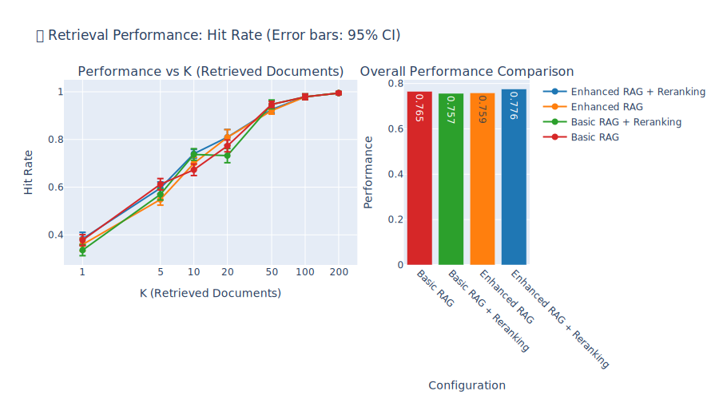{#fig-hit-rate}

Performance saturates around **50 chunks**, which is about 27% of the total chunks per document, and answer correctness plateaus near **92%**. For reference, these documents averaged ~27k tokens split into ~181 chunks of ~150 tokens each; k=50 corresponds to roughly 20k retrieved tokens, or about 40–50 pages of text. That's a lot more retrieval than the k=5 or k=10 that many tutorials suggest.

### Reranking improves retrieval metrics but not answers

Here's the surprising finding. Reranking clearly improves information retrieval metrics like MRR and Recall:

::: {layout-ncol=2}
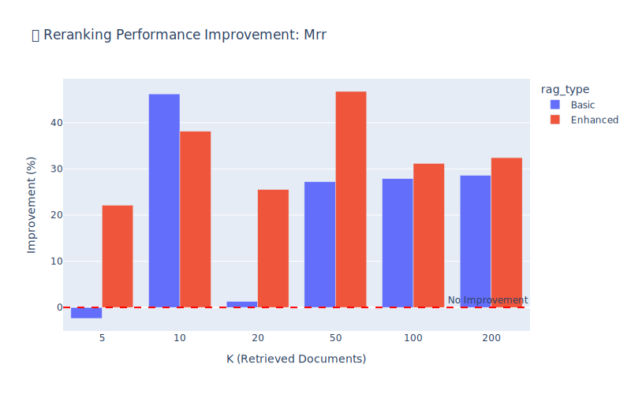{#fig-reranking-mrr}

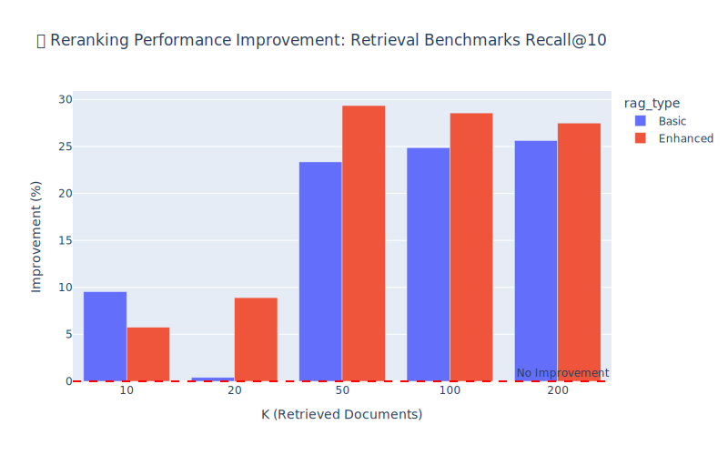{#fig-reranking-recall}
:::

But when we look at what actually matters -- **did the model get the right answer?** -- reranking makes essentially no difference:

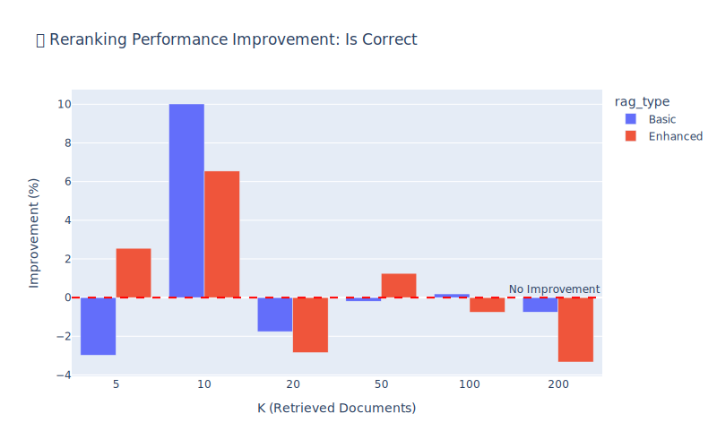{#fig-reranking-correct}

The same null result shows up if you slice correctness across RAG type × reranker × chunk count as a heatmap:

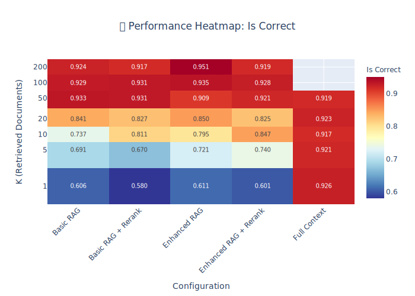{#fig-heatmap-correct}

The cleaner way to say this: at k=50 with a ~20k-token window, the gold chunk is almost always *in* the context (hit rate saturates near 95%), so reordering the 50 chunks inside the window can't move correctness -- there's nothing for positional reranking to fix.

#### Shuffling sometimes *helps*

The stronger piece of evidence against positional reranking is what happens when you actively shuffle retrieved chunks. If lost-in-the-middle were still a dominant effect, shuffling should hurt. It doesn't -- in several conditions it slightly *improves* correctness, consistent with Chroma's observation that attention patterns vary by position and that "put the best chunk first" isn't always the right prior.

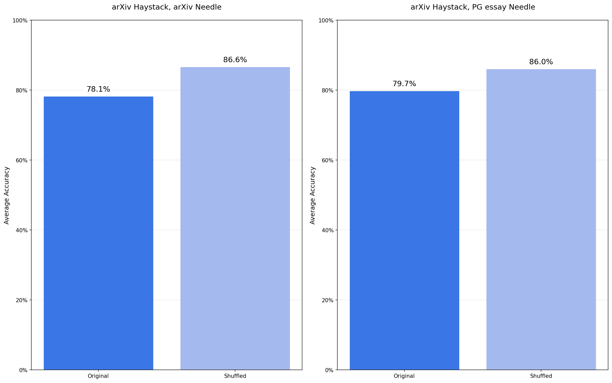{#fig-shuffle}

Taken together, these two results are a narrow but real finding: **the positional justification for reranking has weakened.** Modern LLMs look more position-robust in a 20k-token window than Liu et al.'s 2023 models were. Rerankers still earn their place at low k (where recall, not ordering, is the bottleneck) and as confidence-based filters. The "reorder the top-k to beat lost-in-the-middle" job is the one that's aged.

### Speed comparison

For documents in this size range (~27k tokens per document), the speed between RAG and full context was surprisingly comparable.

{#fig-speed-comparison}

That said, this comparison is for single documents. RAG's core advantage is scaling to large corpora -- and that advantage grows with corpus size. More complex RAG pipelines will also be slower (query rewriting, reranking steps add latency), but their cost scales linearly rather than with the full corpus size.

### RAG takeaways

- **Within a single document, you need much higher K than you think** -- 50 chunks saturated performance in our tests. At corpus scale this likely inverts.
- **Positional reranking didn't improve answers at k=50** -- retrieval metrics improved, correctness didn't. Consistent with shuffling-helps: modern LLMs look position-robust in a 20k window.
- **Speed is comparable** between RAG and full context for small-to-medium documents

## Limitations

Before you go ripping out your RAG pipeline, a long list of caveats -- the RAG experiment specifically is narrower than the plots make it look:

- **Single answer model in the RAG experiment**: everything downstream of retrieval runs on `gpt-4.1-mini`. Stronger or weaker models could shift the null result.
- **Single legacy reranker**: `cross-encoder/ms-marco-MiniLM-L-6-v2` is a 2019-era, 22M-parameter generic reranker. Modern commercial and open-source alternatives are untested here.
- **Document-scale, not corpus-scale**: each query retrieves from one ~27k-token document's chunks (~181 chunks). k=50 is 27% of the document; on a 10k-chunk corpus, k=50 is 0.5% and the "use more chunks" finding likely inverts.
- **Lexical ground truth**: we scored chunks with Jaccard + ROUGE-L + token containment. These are three correlated surface-overlap metrics and don't catch paraphrase; dense retrievers are already optimized for this signal, which biases *against* seeing reranker gains.
- **LLM-as-judge in-family bias**: GPT-4.1 judging GPT-4.1-mini's answers has known self-preference and verbosity bias. A cross-family judge (Claude, Gemini) was not run.
- **Ceiling effect at high k**: hit rate saturates near 95% at k=50, so reranking can't demonstrate a gain on correctness even if it were helping retrieval in principle.
- **Query complexity**: mostly single-hop questions; no adversarial or paraphrase-heavy queries.
- **Single embedding model**: only `text-embedding-3-small`.
- **No cost axis**: we did not measure $/query. Long context at 1M tokens is materially more expensive than RAG at k=50; any "should I switch" decision needs to factor that in.
- **Reranker-as-filter untested**: using reranker confidence scores to *drop* chunks (as opposed to reorder them) is a different use case we didn't evaluate.

## A practical decision framework

Based on these findings, here's how to think about the trade-off. The first distinction to draw is between **document size** and **corpus size** -- they pull in different directions and the post's experiments only speak to the first.

The 100k figure isn't arbitrary as a document-size cutoff. The Natural Questions dataset -- a common realistic-QA benchmark -- has documents averaging ~77k tokens with a stdev of ~55k. Most real QA documents land below 100k; Chroma's work shows this is also where long-context quality starts to hurt.

### Consider skipping RAG when:
- Your **per-query document fits in <100k tokens**
- You have **complex, multi-hop queries** that need cross-referencing -- chunking destroys these relationships even more than long context degrades them
- The **simplicity gain** of removing retrieval infrastructure matters to your team

### Keep RAG when:
- Your **per-query document exceeds 100k tokens**
- You're dealing with **simple, factual queries**
- You need to search across a **large corpus** -- this is RAG's core value and nothing in this post argues against it

### And in both cases:
- If it fits in the context window, speed is likely comparable
- Within a single document, **more chunks than you think** (k=20-50, not k=5). This does *not* transfer to corpus-scale retrieval.
- **Question the positional justification for reranking** -- if you're reranking to dodge lost-in-the-middle at high k, that effect has weakened. Reranking for low-k recall or as a filter is a different story.

## Acknowledgments

The context window quality experiments in Section 2 come directly from Chroma's excellent [Context Rot](https://www.trychroma.com/research/context-rot) article. Their work was a major inspiration for this talk and this post. Thanks to **[orq.ai](https://orq.ai)** for providing unified LLM API access and observability that made running the speed and reranking experiments across multiple providers feasible.

The full code and experiment data are available on [GitHub](https://github.com/Baukebrenninkmeijer/pydata-2025-context-is-king).

---

:::{.callout-tip}
## Running into this in your own stack?
This post is based on my PyData Amsterdam 2025 talk *"Context is King: Your RAG Pipeline is Probably Overkill."* If you're weighing long context vs RAG for your own system, or want to share findings that contradict mine, I'd genuinely like to hear from you -- [find me on LinkedIn](https://www.linkedin.com/in/bauke-brenninkmeijer-40143310b/).
:::
